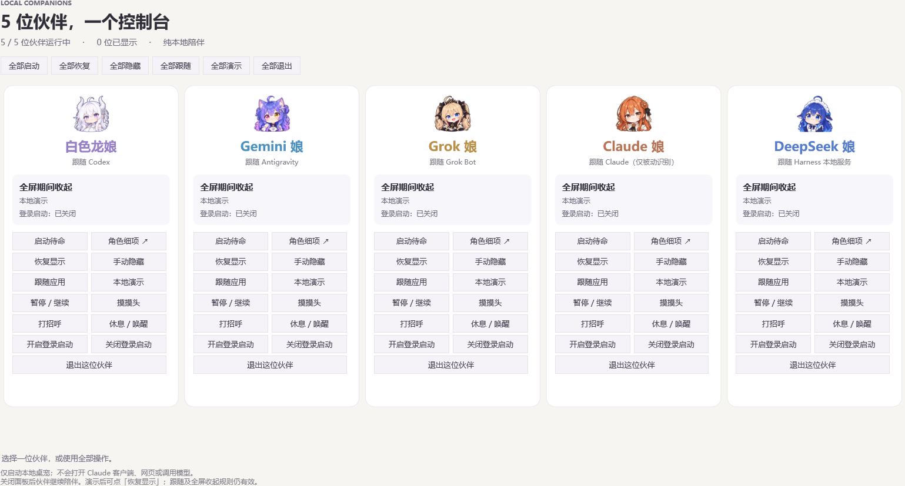

# AI Mascot Desktop · AI 娘桌面伙伴

五位本地桌宠，一个控制台。支持白色龙娘、Gemini 娘、Grok 娘、Claude 娘和 DeepSeek 娘。

<p>
 
 
 
 
 
</p>

Windows x64 / C# / WPF / .NET 10。**无 API Key、无模型调用、无聊天读取、无任务 Hooks、无遥测。** 人物动作由本地规则驱动。



截图来自本地运行包；截图时全屏隐藏规则生效。人物素材许可见文末说明。

## 下载与运行

1. 从 [Releases](https://github.com/Eclipse017/AI-Mascot-Desktop/releases) 下载 Windows x64 ZIP。
2. 解压整个文件夹到你选择的位置，双击 **`AIMascot.Console.exe`**。自包含运行包无需安装 .NET SDK，也无需管理员权限。
3. 首次打开默认为本地演示，五位依次排列。可以拖动人物；点击招呼，在额头来回移动可摸头；右键打开菜单。

控制台支持单独/全部启动、恢复、隐藏、跟随、演示、暂停和退出。隐藏后要再看见人物，可点“全部演示”再点“全部恢复”。关闭控制台后伙伴继续运行；“全部退出”只退出本项目的桌宠。

角色细项可调节大小、位置、休息和登录启动。默认不启用登录启动；若启用后移动整个包，需从新位置重新开启。所有 EXE、DLL 和子目录都要一起保留。

**本项目不会启动任何 AI 客户端、网页、CLI 或模型，包括 Claude。** 演示不需要安装对应 AI 应用。“跟随”只是被动检测应用是否运行，不代表 AI 思考或任务进度。本项目与相关 AI 品牌没有官方关联。

## 可选：跟随应用

| 角色 | 识别方式 |
| --- | --- |
| 白色龙娘 | Windows 注册的 Codex 桌面包身份 |
| Gemini 娘 | 当前用户标准安装的 Antigravity；可配置自定义路径 |
| Grok 娘 | 配置的 Grok Bot 桌面 EXE 路径及产品信息；不是 grok CLI |
| Claude 娘 | Windows 返回的 Claude 包家族与包内 EXE 路径；只读检测 |
| DeepSeek 娘 | 配置的 Harness Desktop 0.1.7-rc.2 路径、版本文件哈希和服务监听 PID |

自定义路径写入 `%LOCALAPPDATA%\AI-Mascot-Desktop\targets.json`，例如：

```json
{
  "gemini": "%LOCALAPPDATA%\\Programs\\antigravity\\Antigravity.exe",
  "grok": "C:\\YourApps\\Grok Bot\\Grok Bot.exe",
  "deepseek": "C:\\YourApps\\DeepSeek Harness\\DeepSeek Harness.exe"
}
```

只填写本机真实 EXE 的完整路径，不附加参数；修改后退出并重新启动对应桌宠。这些路径永远不会用于启动程序。未配置、身份不符或服务升级时显示 Unknown，仍可本地演示。DeepSeek 关闭网页不等于停止本地服务；目前不支持任意版本 Harness 的自动匹配。

## 从源码构建

需要 Windows、PowerShell 7、.NET 10 SDK（10.0.100 或更高的 10.0 feature band）。

```powershell
pwsh -NoProfile -File ./scripts/Build.ps1 -Publish
```

脚本先运行核心、Windows、控制器和路径解析检查，再发布自包含包。输出路径显示为 `PACKAGE: ...`。也可通过 `AI_MASCOT_DOTNET` 环境变量指定本机 SDK 的 dotnet 可执行文件。角色程序和控制台在同一目录，共享相同 .NET 运行文件；打包时逐项验证同名文件一致。

只有 `src/`、`roles/`、`platform/`、`console/`、`tests/` 和运行素材参与构建。本仓库从经过选择的公开文件创建独立历史，不包含个人开发日志、机器诊断、快捷方式备份或原始社区参考图。

在没有公开版桌宠运行时，可用 `pwsh -NoProfile -File ./scripts/Verify-Portable.ps1 -PackagePath "完整运行包目录"` 进行本地集成检查。脚本启动并退出本项目的五位桌宠，恢复显示偏好，不修改登录启动，也不启动 AI 客户端。首版验证范围见 [VALIDATION.md](VALIDATION.md)。

## 隐私与已知限制

偏好与有限状态文件位于 `%LOCALAPPDATA%\AI-Mascot-Desktop`，每位独立。只记录当前桌宠状态及最近最多 32 条自身交互，不记录键盘、全局鼠标、窗口文本、聊天或任务。公开版有独立进程名、IPC、设置及登录项，可与早期本地版分开运行。

目前是三帧表情与整体动作，没有 Live2D 骨骼、行走或 AI 聊天。模拟状态/内部渲染检查与真实系统鼠标验收分开记录；多屏混合 DPI、热插拔、真实休眠/注销和独占全屏仍需更广泛测试。Claude 真实启动及在线联动未测试，所有 Claude 验证都在本地完成。

## 许可

代码与文档采用 [MIT](LICENSE)。**PNG/ICO 人物素材不包含在 MIT 代码许可内**，来源、随包使用范围与角色权利边界见 [ASSETS.md](ASSETS.md)。依赖和技术参考见 [THIRD-PARTY-NOTICES.md](THIRD-PARTY-NOTICES.md)。

---

**English:** Five offline Windows desktop companions in one control panel. Download the self-contained ZIP, extract everything and run `AIMascot.Console.exe`. The first run uses local demo mode. No AI account, API key, model request, chat access or telemetry is required. The app never launches Claude or any other AI client. Code is MIT; bundled generated artwork has a separate notice. Windows x64 only.
